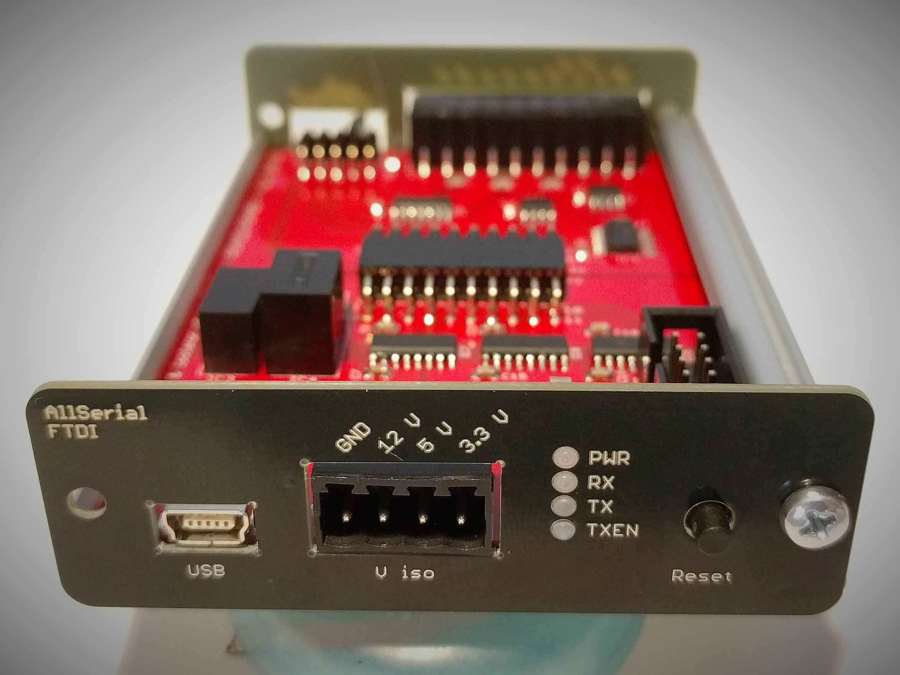
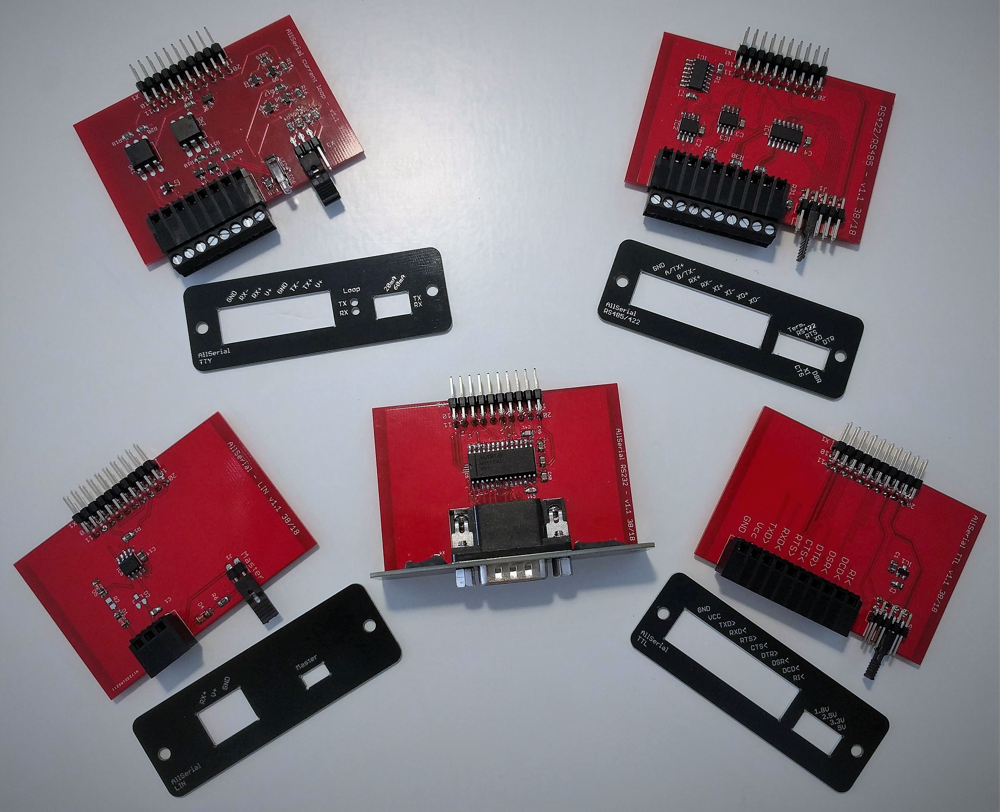

# AllSerial
An universal sophisticated USB-serial converter
Over the course of time I had to work with many different devices which had to be connected via a kind of serial interface. There are lots of different cheap USB-serial adapters available, but no adapter was including all features I needed in a single device. Every USB-serial adapter has in common the USB Controller. So I came up with the idea having a masterboard providing all the common features like USB interface, isolation and diagnostic elements. The most used interfaces (RS232, RS485, TTL UART, TTY current loop & LIN) are build up on slave modules which can be plugged into the mainboard. If a custom interface is needed, there is an EAGLE lib available making it easy to it on your own. 

## Features
- Open source
- Isolated
- Reset button for reenumerating device on the USB
- Status LEDs (RX, TX, Power, TXEN)
- modular, just exchange daughterboard for different interfaces
- RS232 completley connected (RXD, TXD, RTS, CTS, DTR, DSR, RI, DCD)
- RS485, RS422 with Handshake
- TTY current loop 4/3/2 wire active/passive
- LIN
- TTL 1.8/2.5/3.3/5 V
- EAGLE lib for easily creating custom modules

# Modules (tested & working)
* [Mainboard FT232](1A_MAIN_FTDI/)
* [RS 422/485](2_RS485_RS422/)
* [RS 232](3_RS232/)
* [TTL](4_TTL/)
* [TTY current loop](5_TTY/)
* [LIN](6_LIN/)

# Modules (planned)
* mBus master
* eBus
* 1wire with DS2480B
* arduino nano clone

# Software
* [hterm](http://www.der-hammer.info/terminal/) (windows)
* [putty](https://www.chiark.greenend.org.uk/~sgtatham/putty/latest.html) (windows/unix)
