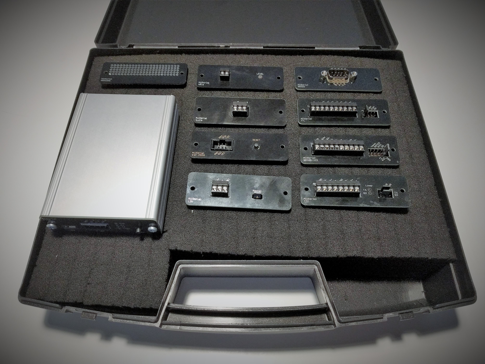
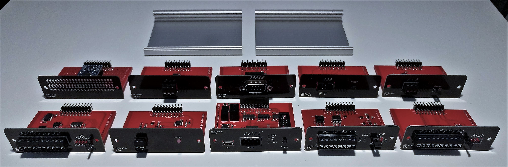
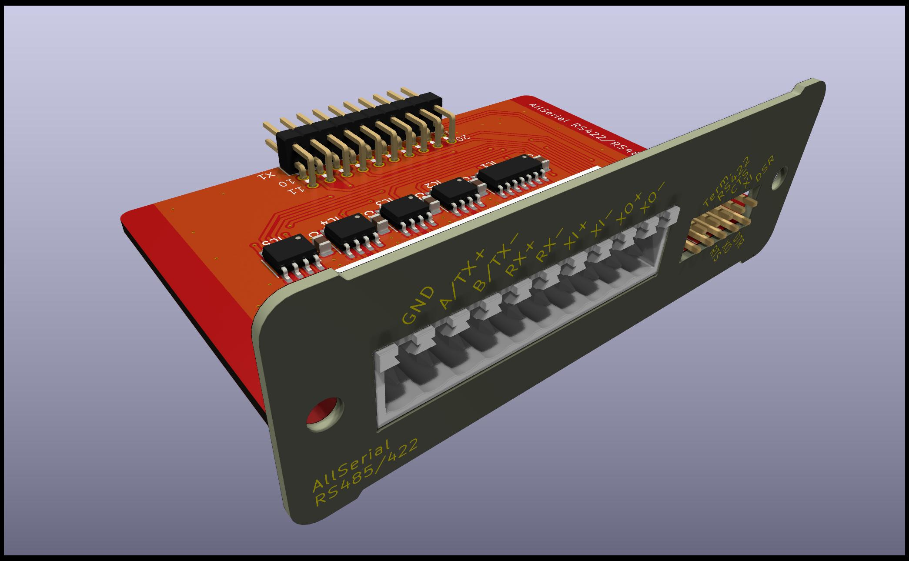
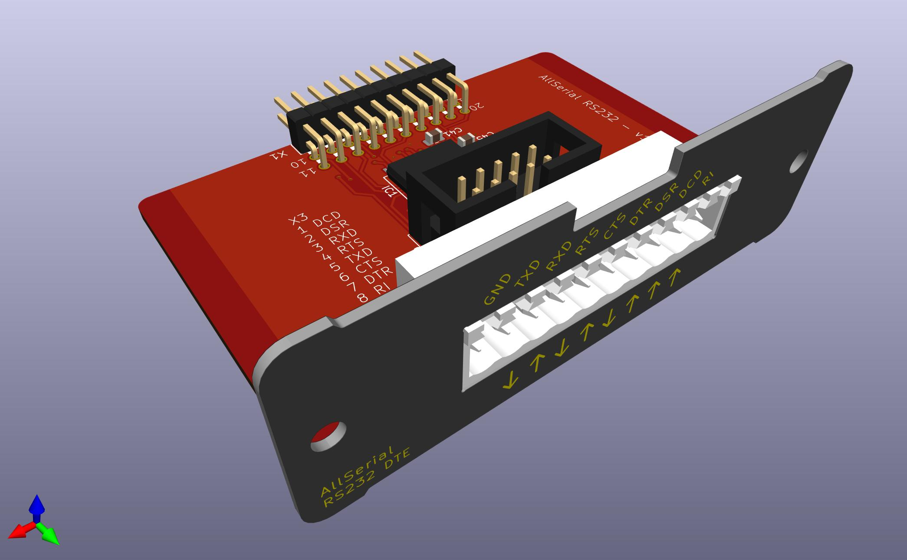
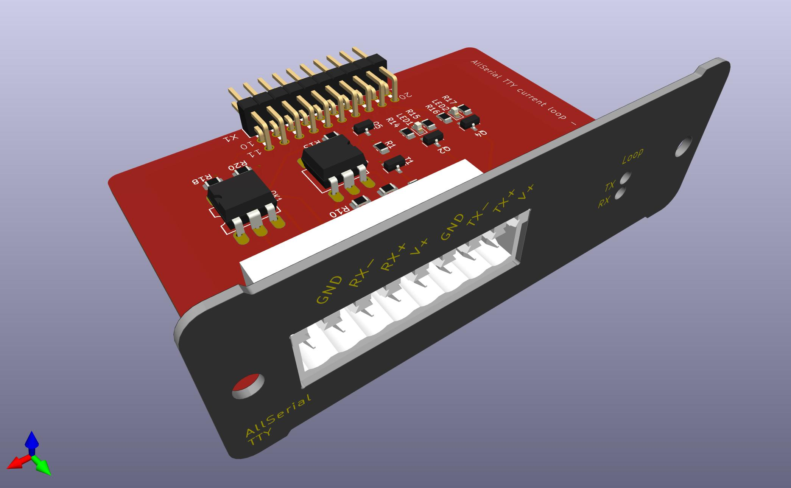
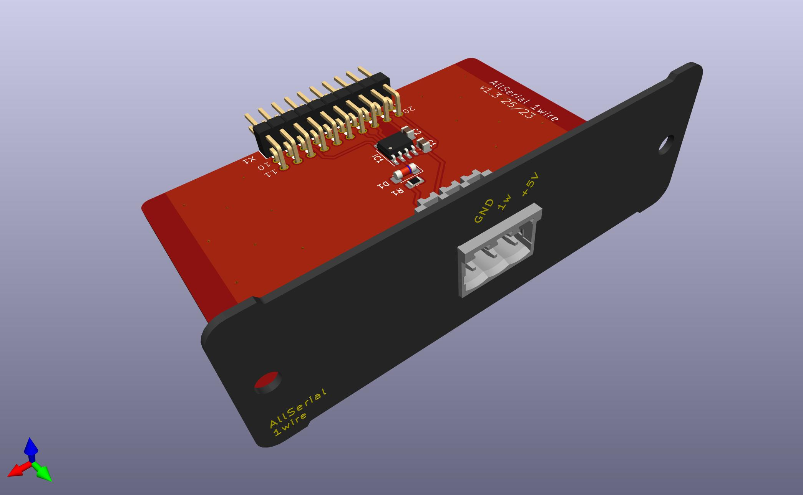
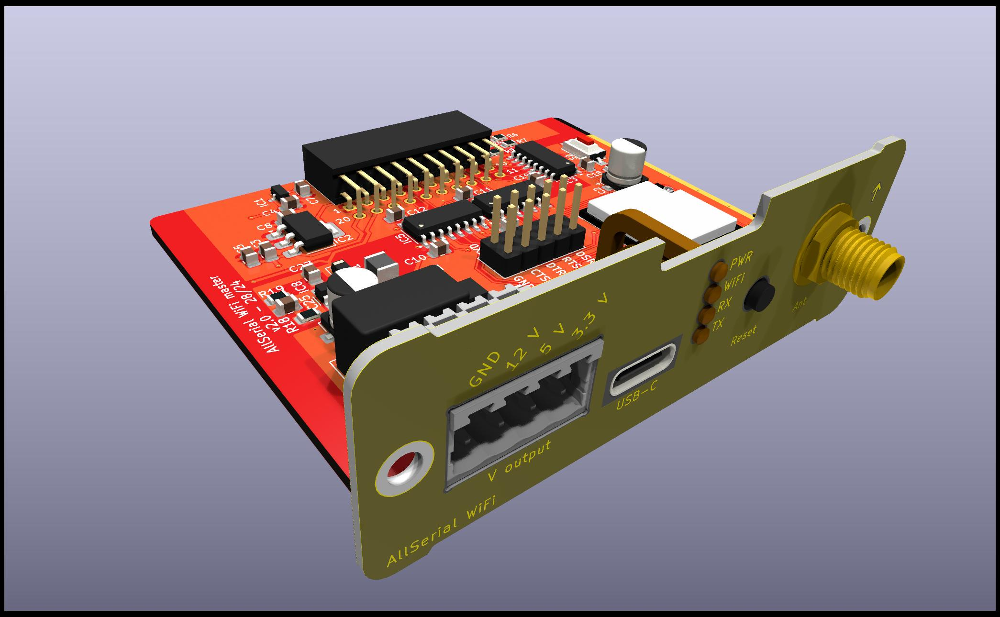

# AllSerial
## An universal sophisticated USB-serial converter

SEE PROJECTHOMEPAGE UNDER [https://www.seegel-systeme.de/2025/07/10/allserial](https://www.seegel-systeme.de/2025/07/10/allserial)

Over the course of time I had to work with many different devices which had to be connected via a kind of serial interface. There are lots of different cheap USB-serial adapters available, but no adapter was including all features I needed in a single device. Every USB-serial adapter has in common the USB Controller. So I came up with the idea having a masterboard providing all the common features like USB interface, isolation and diagnostic elements. The most used interfaces (RS232, RS485, TTL UART, TTY current loop & LIN) are build up on slave modules which can be plugged into the mainboard. If a custom interface is needed, there is an KiCad library available making it easy to create one by yourself. 

## Features
- Open source
- Isolated
- Reset button for reenumerating device on the USB
- Status LEDs (RX, TX, Power, TXEN)
- modular, just exchange daughterboard for different interfaces
- RS232 completley connected (RXD, TXD, RTS, CTS, DTR, DSR, RI, DCD)
- RS485, RS422 with Handshake
- TTY current loop 4/3/2 wire active/passive
- LIN
- TTL 1.8/2.5/3.3/5 V
- KiCad library for easily creating custom modules

## Modules (tested & working)
* Mainboard FT232

* RS 422/485 

* RS 232 

* TTL 

* TTY current loop 

* LIN 

* 1wire (with DS2480B) 

* Programmer for ESP8266 (auto reset&boot) 

## Modules (under development)
* Mainboard with ESP32-S3 for accessing slave modules via USB, WiFi & Bluetooth 

* mBus master
* Digi XBee radiomodem 

* eBus 

## Software
* [hterm](http://www.der-hammer.info/terminal/) (windows)
* [putty](https://www.chiark.greenend.org.uk/~sgtatham/putty/latest.html) (windows/unix)
