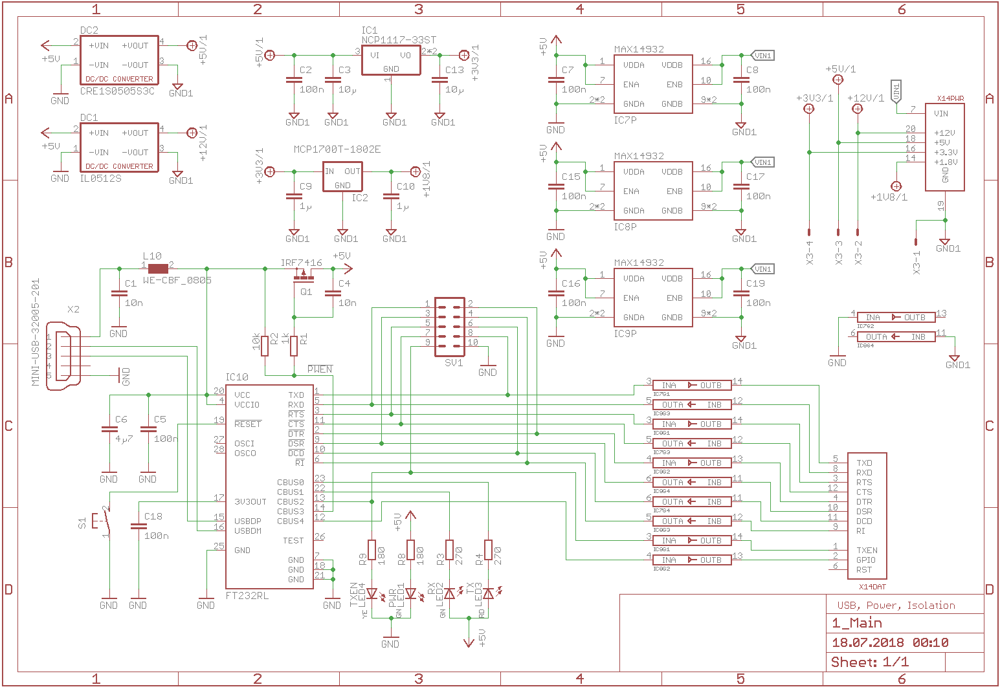
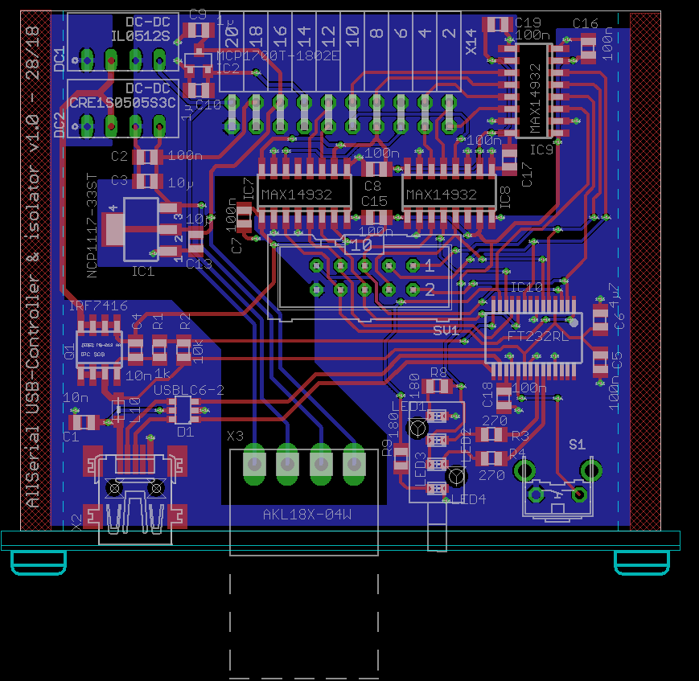
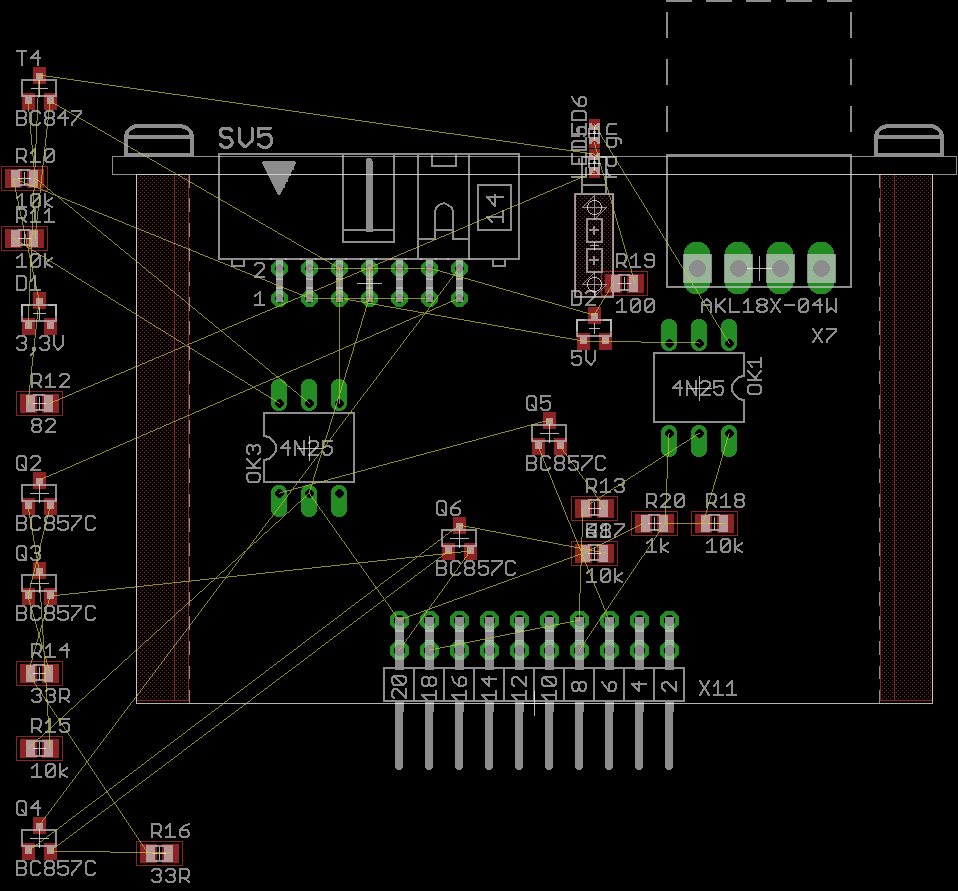
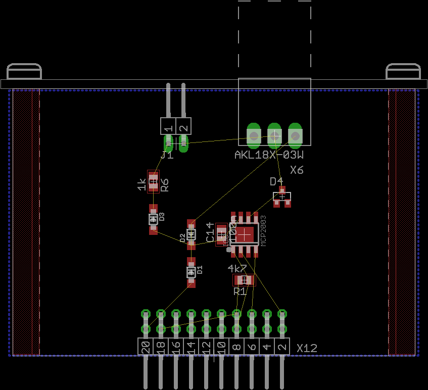

# AllSerial
An universal open source USB-serial converter for RS232, RS485, RS232, TTL, TTY current loop, mBus

## Features
- Isolated
- Reset button for reenumerating device on the USB
- Status LEDs
- modular, just exchange daughterboard for different interfaces

# Modules
## 1A Mainboard FT232

* Isolated between controller and daughterboards
* pin header for connecting logicanalyer

## 2 RS422/RS485

* Jumper for termination
* Second doublepait for RS422 with handshake lines

## 3 RS232

* Full connection: TXD, RXD, CTS, RTS, DTR, DSR, DCD, RI
* 9 pin Sub-D male connector

## 4 TTL

* Full connection: TXD, RXD, CTS, RTS, DTR, DSR, DCD, RI
* Selectable voltage 5 V, 3.3 V, external

## 5 Current loop (TTY)

* Jumper for mode (2/3/4-wire, passiv/active)
* Jumper for currentselection (20 mA / 40 mA)

## 6 LIN

* Jumper for master

## 7 mBus master

# Device notes
Housing: Fischer AKG 71 24 100 ME
Mainboard LEDs Mentor 1296.1004
