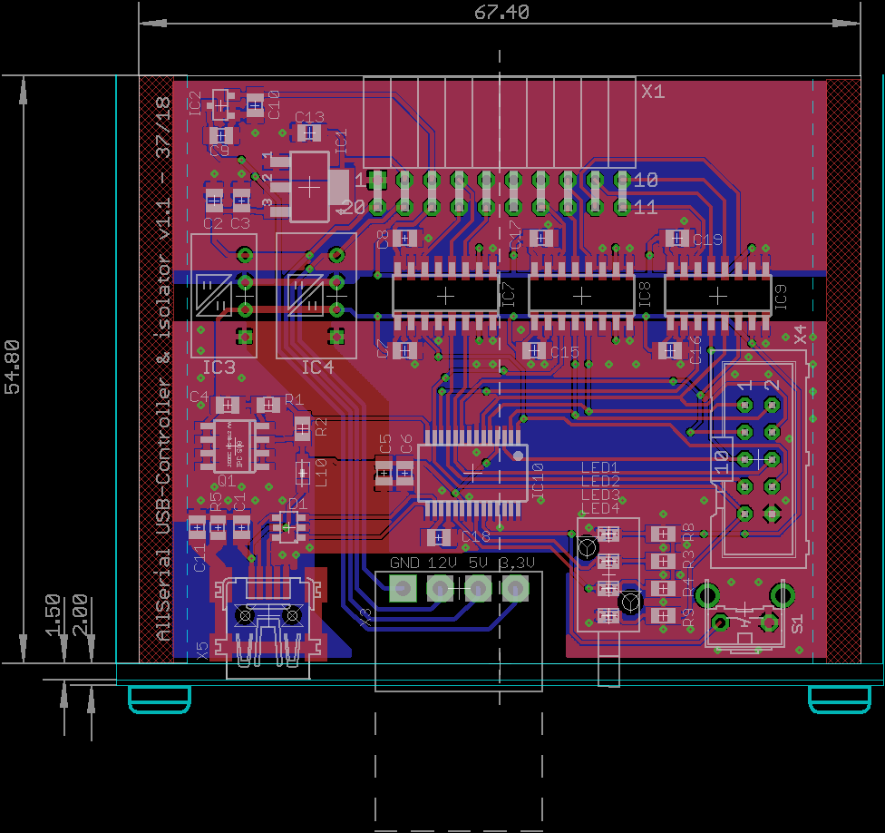
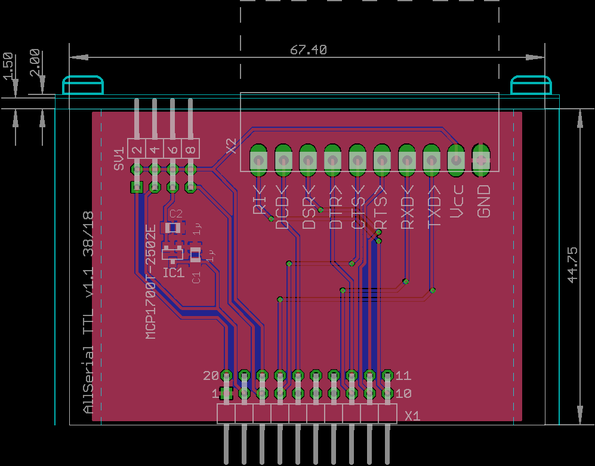

# AllSerial
An universal sophisticated USB-serial converter

## Features
- Open source
- Isolated
- Reset button for reenumerating device on the USB
- Status LEDs (RX, TX, Power, TXEN)
- modular, just exchange daughterboard for different interfaces
- RS232 completley connected (RXD, TXD, RTS, CTS, DTR, DSR, RI, DCD)
- RS485, RS422 with Handshake
- TTY current loop 4/3/2 wire active/passive
- LIN
- TTL 1.8/2.5/3.3/5 V

# Modules
## 1A Mainboard FT232

* Isolated between controller and daughterboards
* pin header for connecting logicanalyzer
* Reichelt Warenkorb: https://www.reichelt.de/my/1489962

## 2 RS422/RS485

* Jumper for termination
* Additional doublepair for RS422 with handshake lines
* Reichelt Warenkorb: https://www.reichelt.de/my/1489968

## 3 RS232

* Full connection: TXD, RXD, CTS, RTS, DTR, DSR, DCD, RI
* 9 pin Sub-D male connector
* Reichelt Warenkorb: https://www.reichelt.de/my/1490023

## 4 TTL

* Full connection: TXD, RXD, CTS, RTS, DTR, DSR, DCD, RI
* Selectable voltage 5 V, 3.3 V, 2.5 V, 1.8 V, external
* Reichelt Warenkorb: https://www.reichelt.de/my/1490024

## 5 Current loop (TTY)
](./5_TTY/5_TTY_SCHEM.png)

* Jumper for mode (2/3/4-wire, passiv/active)
* Jumper for currentselection (5 / 20 / 60 mA)
* Reichelt Warenkorb: https://www.reichelt.de/my/1490298

## 6 LIN
](./6_LIN/6_LIN_SCHEM.png)

* Jumper for master
* Reichelt Warenkorb: https://www.reichelt.de/my/1512118

## 7 mBus master
planned

## 8 eBus
planned

## 9 1wire bus

# notes
USB hardware design guide for FTDI ICs: https://www.google.com/url?sa=t&rct=j&q=&esrc=s&source=web&cd=3&ved=0ahUKEwjRm7euw6jcAhUHKewKHaPXCe0QFghIMAI&url=http%3A%2F%2Fwww.ftdichip.com%2FSupport%2FDocuments%2FAppNotes%2FAN_146_USB_Hardware_Design_Guidelines_for_FTDI_ICs.pdf&usg=AOvVaw03a2woa2nwI7w2zJgOb3nb